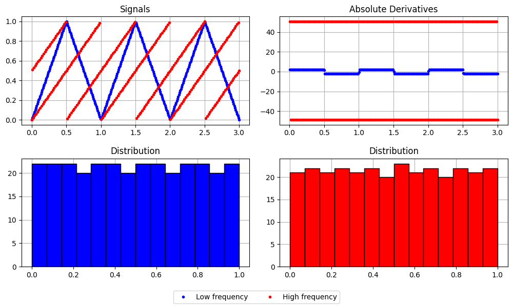
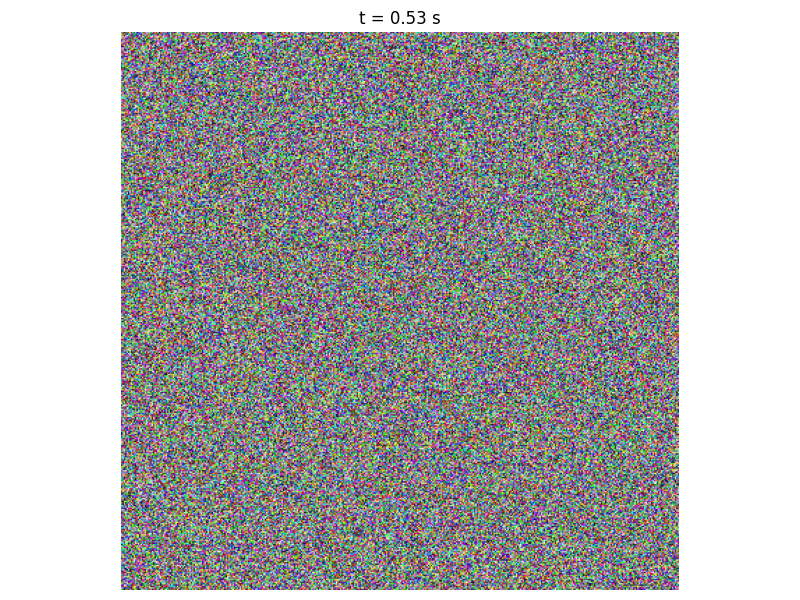

# `roxel`

This miniature project is an investigation into perception of shapes from motion.

Can you see a pattern in the following picture?


No? How about in the following picture?


What about in the following GIF?


You should be able to see a pattern, that you weren't able to see from looking at the individual frames of the GIF.

That is to say, it is only by perceiving the **motion** of the animation, that you were able to see the pattern.

What does this tell us about human visual perception? Would modern AI approaches to computer vision be able to demonstrate this behaviour?

The images and animations above can be generated with the following command:

```
python scripts/make_square_gif.py
```

## Another example

Here is another example (the pattern in this one is more complex, and slightly harder to spot):


## Flashing messages

```
python scripts/flashing_msg.py
```




```
python scripts/flashing_msg.py --text_str "MERRY\nCHRIS\nTMAS!" --output_dir outputs/flash_msg_xmas
```





